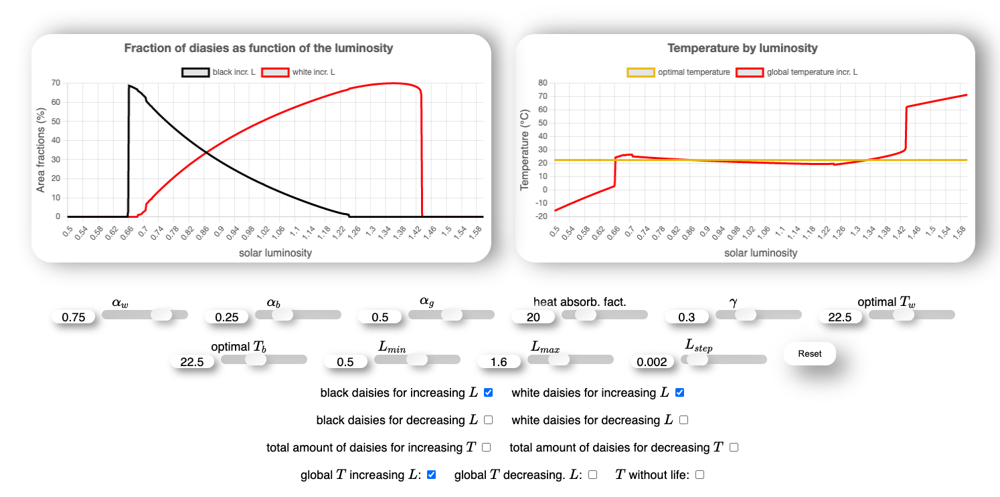

# [Daisyworld Model - Website](https://btschwertfeger.github.io/Daisyworld-Model-Website/)

Daisyworld is a theoretical cloudless planet with negligible greenhouse gases where only black and white daisies live. The white ones have a higher albedo than the black ones. Together they regulate the climate on the planet

A website designed to enable people interested in climate modeling to understand the Daisyworld model.

## Availability

- [https://btschwertfeger.github.io/Daisyworld-Model-Website/](https://btschwertfeger.github.io/Daisyworld-Model-Website/)
- [https://www.awi.de/ ....](https://www.awi.de/fileadmin/user_upload/AWI/Forschung/Klimawissenschaft/Dynamik_des_Palaeoklimas/DaisyWorld/index.html)

## References

- WATSON, A.J. and LOVELOCK, J.E. (1983), Biological homeostasis of the global environment: the parable of Daisyworld. Tellus B, 35B: 284-289. https://doi.org/10.1111/j.1600-0889.1983.tb00031.x
